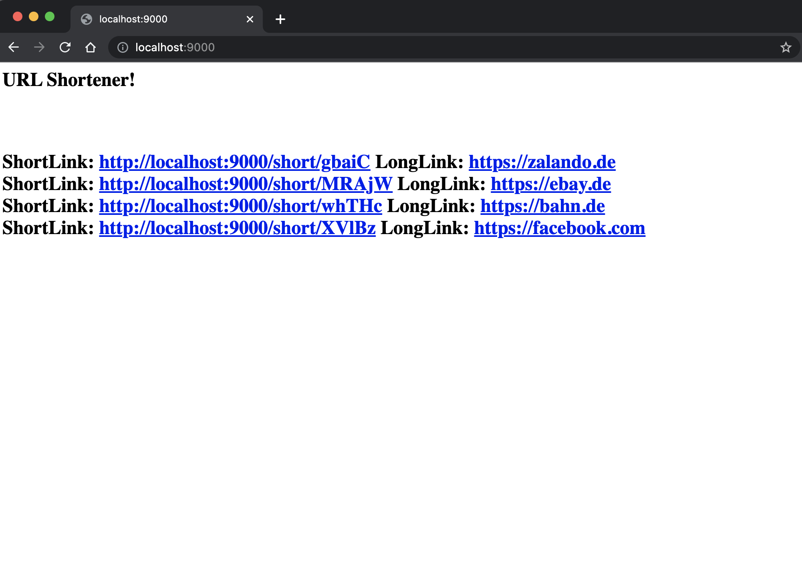

# Go url shortner

## pre requisites

* [`go`](https://go.dev/dl/) , the project was tested on `go 1.19.2`.
* make sure the port `9000` is free, you can change it in the `main.go` file by changing the `portNumber` variable, it's set to `9000` for now.
* you can [kill the process](https://stackoverflow.com/a/47469113/10672994) running on port `9000` by `lsof -i:9000 -t | xargs -r kill`   .

## how to run
  clone the repository and from the root directory run  `make start`
  ```
  ls
  Readme.md         go.mod            home.go           homepage.png      main.go           makefile          shortLink.go      visitShortLink.go

  make start
  go run .
  2022/10/27 02:14:03 Server started on port :9000
  ```

### how to shorten a url
  * the endpoint is `/shortLink`
  
```
curl --location --request GET 'http://localhost:9000/shortLink?link=https://fb.com'
```
* the output of above curl request will be
```
Short link for [https://fb.com] is http://localhost:9000/short/VnneJEfMWY
```

* incase if you provide a wrong URL
```
curl --location --request GET 'http://localhost:9000/shortLink?link=htt//stackoverflow.com'
```
* the output of above curl request will be
```
Could not create shortlink need absolute path link. Ex: /shortLink?link=https://moia.io
```

### HomePage
* the endpoint is `/` it's just a basic HTML page that just displays all the links shortened by the app.
* after making a curl request to `/shortLink` endpoint, you can see the link in the homepage once you refresh it
  


### storage
* the storage is map in memory, so if you restart the app, all the links will be lost.
